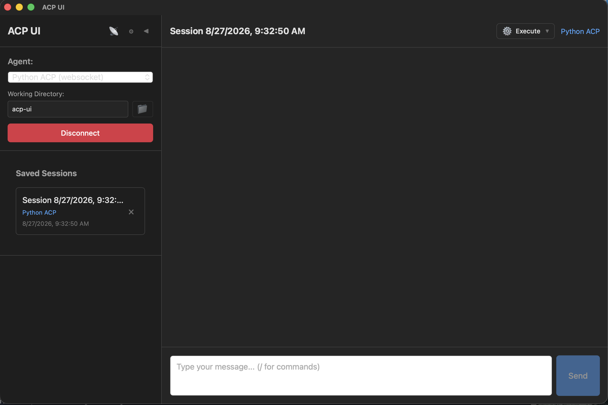

# ACP UI

<a href="https://apps.microsoft.com/detail/9P76NGS1VF2L?referrer=appbadge&mode=full" target="_blank"  rel="noopener noreferrer">
	
</a>

A modern, cross-platform client for the [Agent Client Protocol (ACP)](https://agentclientprotocol.com/) on desktop, mobile, and the web. Connect to AI coding agents like GitHub Copilot, Claude Code, Gemini CLI, Qwen Code, Codex CLI, OpenCode, OpenClaw, Kiro CLI, Hermes Agent, and any ACP-compatible agent from a unified interface.




## 🌍 Try it in your browser

No install required — open **[https://acp-ui.github.io/](https://acp-ui.github.io/)** and connect to a remote ACP agent over WebSocket. The web build supports the same chat, sessions, permissions, and traffic-monitor features as the desktop and mobile apps; it only omits local stdio agents and host filesystem access (which require a local subprocess and aren't available in a browser tab).

> Pages served over HTTPS can only open `wss://` URLs (browser mixed-content rule). For LAN `ws://` access, run the bundle locally (`npm run preview:web`) or use a `wss://` tunnel — see [Connecting from your phone or browser](#-connecting-from-your-phone-or-browser), the same setup works for the web build.

## 📥 Installation

Download the latest release for your platform from [GitHub Releases](https://github.com/formulahendry/acp-ui/releases):

| Platform | Download |
|----------|----------|
| **Web** | [https://acp-ui.github.io/](https://acp-ui.github.io/) — no install, opens in any modern browser |
| **Windows** | [.msi installer](https://github.com/formulahendry/acp-ui/releases/latest) or [.exe (NSIS)](https://github.com/formulahendry/acp-ui/releases/latest) |
| **macOS (Apple Silicon)** | [.dmg (ARM64)](https://github.com/formulahendry/acp-ui/releases/latest) |
| **macOS (Intel)** | [.dmg (x64)](https://github.com/formulahendry/acp-ui/releases/latest) |
| **Linux (x64)** | [.deb](https://github.com/formulahendry/acp-ui/releases/latest) or [.AppImage](https://github.com/formulahendry/acp-ui/releases/latest) or [.rpm](https://github.com/formulahendry/acp-ui/releases/latest) |
| **Linux (ARM64)** | [.deb](https://github.com/formulahendry/acp-ui/releases/latest) or [.AppImage](https://github.com/formulahendry/acp-ui/releases/latest) or [.rpm](https://github.com/formulahendry/acp-ui/releases/latest) |
| **Android** | [.apk](https://github.com/formulahendry/acp-ui/releases/latest) — sideload via "Install unknown apps" |
| **iOS** | Build from source (see [Building for iOS](#building-for-ios)) — no prebuilt binary |

> Mobile and web builds connect to remote agents over WebSocket. See [Connecting from your phone or browser](#-connecting-from-your-phone-or-browser) for how to expose a local agent so a phone or browser can reach it.

### macOS first-launch note

The macOS `.dmg` builds are ad-hoc signed but **not** notarized (no paid Apple Developer account), so on first launch macOS shows a dialog like *"Apple could not verify acp-ui is free of malware."* The app is not damaged — this is Gatekeeper's standard warning for un-notarized apps. Easiest fix, run once after installing or upgrading:

```bash
xattr -dr com.apple.quarantine /Applications/acp-ui.app
```

Then open the app normally. Alternatives if you'd rather not use the terminal:

- **macOS 15 Sequoia and later** — open **System Settings → Privacy & Security**, scroll to the bottom, click **Open Anyway** next to the acp-ui entry, authenticate, then re-launch the app.
- **macOS 14 Sonoma and earlier** — right-click (or Control-click) `acp-ui.app` in Finder → **Open** → click **Open** in the follow-up dialog.

## ✨ Features

- **Multi-Agent Support** — Connect to any ACP-compatible agent
- **Remote agents over WebSocket** — Talk to agents on another machine via `ws://` / `wss://`
- **Web app** — Run in any modern browser at [acp-ui.github.io](https://acp-ui.github.io/) without installing anything
- **Mobile** — Android APK shipped on Releases; iOS via local Xcode build
- **Foreground reconnect** — On mobile and the web, automatically reattaches to your session when the app/tab regains focus
- **Session Management** — Create, resume, and manage conversation sessions
- **Rich Chat Interface** — Markdown rendering, syntax highlighting, tool call visualization
- **Slash Commands** — Quick access to agent capabilities with `/command` syntax
- **Permission Controls** — Approve or deny agent actions before execution
- **Session Modes** — Switch between agent modes (ask, code, architect, etc.)
- **Model Picker** — Select from available AI models (unstable API)
- **Agent Thinking** — View the agent's reasoning process (collapsible)
- **Environment Variables** — Configure per-agent environment variables (API keys, settings)
- **Traffic Monitor** — Debug and inspect ACP protocol messages in real-time
- **Hot-Reload Config** — Edit agent configurations without restarting (desktop)
- **White-Label Branding** — Ship the app under your own name and icon (see [White-label branding](#white-label-branding))
- **Cross-Platform** — Web (any modern browser), Windows, macOS (ARM/Intel), Linux (x64/ARM64), Android, iOS

## 🎯 Default Agents

ACP UI comes pre-configured with these agents:

| Agent | Package |
|-------|---------|
| [GitHub Copilot](https://github.com/github/copilot-language-server-release?tab=readme-ov-file#agent-client-protocol-acp-preview) | `@github/copilot-language-server` |
| [Claude Code](https://github.com/anthropics/claude-code) | `@agentclientprotocol/claude-agent-acp` |
| [Gemini CLI](https://github.com/google-gemini/gemini-cli) | `@google/gemini-cli` |
| [Qwen Code](https://github.com/QwenLM/qwen-code) | `@qwen-code/qwen-code` |
| [Auggie CLI](https://github.com/AugmentCode/auggie) | `@augmentcode/auggie` |
| [Qoder CLI](https://github.com/qoder-ai/qodercli) | `@qoder-ai/qodercli` |
| [Codex CLI](https://github.com/zed-industries/codex-acp) | `@zed-industries/codex-acp` |
| [OpenCode](https://github.com/opencode-ai/opencode) | `opencode-ai` |
| [OpenClaw](https://github.com/nicobailon/openclaw) | `openclaw` |
| [Kiro CLI](https://github.com/aws/kiro) | `kiro-cli` |
| [Hermes Agent](https://github.com/nichochar/hermes) | `hermes` |

## 🛠️ Configuration

Agent configurations are stored in:

| Platform | Path |
|----------|------|
| Windows | `%APPDATA%\acp-ui\agents.json` |
| macOS | `~/Library/Application Support/acp-ui/agents.json` |
| Linux | `~/.config/acp-ui/agents.json` |
| Android | `/data/data/formulahendry.acp_ui/files/agents.json` (managed via Settings UI) |
| iOS | App sandbox — managed via Settings UI |
| Web | Browser `localStorage` (key `acp-ui:agents`) — managed via Settings UI |

> On mobile and the web the config file isn't user-accessible — add and edit agents through the in-app **Settings** dialog. Stdio agents are filtered out of the list since they can't run in a browser or on a phone. Web-app config is per-browser per-origin: it doesn't sync across machines, and clearing site data wipes it.

### Local stdio agents (desktop)

### Example Configuration

```json
{
  "agents": {
    "GitHub Copilot": {
      "command": "npx",
      "args": ["@github/copilot-language-server@latest", "--acp"],
      "env": {}
    },
    "Claude Code": {
      "command": "npx",
      "args": ["@agentclientprotocol/claude-agent-acp@latest"],
      "env": {
        "ANTHROPIC_API_KEY": "sk-ant-..."
      }
    },
    "Gemini CLI": {
      "command": "npx",
      "args": ["@google/gemini-cli@latest", "--experimental-acp"],
      "env": {}
    },
    "Qwen Code": {
      "command": "npx",
      "args": ["@qwen-code/qwen-code@latest", "--acp", "--experimental-skills"],
      "env": {}
    },
    "Auggie CLI": {
      "command": "npx",
      "args": ["@augmentcode/auggie@latest", "--acp"],
      "env": {"AUGMENT_DISABLE_AUTO_UPDATE": "1"}
    },
    "Qoder CLI": {
      "command": "npx",
      "args": ["@qoder-ai/qodercli@latest", "--acp"],
      "env": {}
    },
    "Codex CLI": {
      "command": "npx",
      "args": ["@zed-industries/codex-acp@latest"],
      "env": {}
    },
    "OpenCode": {
      "command": "npx",
      "args": ["opencode-ai@latest", "acp"],
      "env": {}
    },
    "OpenClaw": {
      "command": "npx",
      "args": ["openclaw", "acp"],
      "env": {}
    },
    "Kiro CLI": {
      "command": "kiro-cli",
      "args": ["acp"],
      "env": {}
    },
    "Hermes Agent": {
      "command": "hermes",
      "args": ["acp"],
      "env": {}
    }
  }
}
```

> **Note**: Environment variables are passed to the agent process on startup. Use these for API keys, custom settings, or overriding default behavior.

### Remote agents over WebSocket

For agents running on another machine — or for connecting from a phone to an agent on your laptop — use the `websocket` transport instead of `command`:

```json
{
  "agents": {
    "Copilot CLI (remote)": {
      "transport": "websocket",
      "url": "wss://acp.example.com/v1",
      "headers": { "Authorization": "Bearer YOUR_TOKEN" }
    }
  }
}
```

Both `ws://` (cleartext, for LAN / Dev Tunnels) and `wss://` (TLS) are accepted. `Authorization: Bearer <token>` is propagated as a WebSocket subprotocol because browser/WebView WebSocket APIs cannot set custom HTTP headers.

> **⚠️ How your bearer token is handled**
>
> **In transit.** Browser and WebView WebSocket APIs cannot set arbitrary HTTP headers, so an `Authorization: Bearer <token>` header is folded into the handshake's `Sec-WebSocket-Protocol` list as `bearer.<token>`. The practical consequence: **`Sec-WebSocket-Protocol` is logged by reverse proxies and tunnels far more routinely than `Authorization` is.** nginx records it as `$http_sec_websocket_protocol`, and cloud load balancers, Dev Tunnels, and ngrok-style services commonly capture it in access logs. `Authorization` is usually redacted by default; this header is not. Do not point a tokened agent at a tunnel whose access logs you do not control, and prefer `wss://` so the handshake is at least encrypted on the wire.
>
> **At rest.** Tokens are stored **unencrypted**, alongside the rest of the agent config:
>
> | Platform | Location |
> |---|---|
> | macOS | `~/Library/Application Support/acp-ui/agents.json` |
> | Linux | `~/.config/acp-ui/agents.json` |
> | Windows | `%APPDATA%\acp-ui\agents.json` |
> | Web build | `localStorage`, key `acp-ui:agents` |
>
> The file has default permissions and no OS keychain is used, so treat it as a secret: anything that can read your home directory can read your tokens. On the web build, any script running in the page's origin can read them.
>
> In the app, header and environment-variable values are masked in Settings behind a per-row reveal toggle. Tokens are not recorded by the Traffic Monitor, which logs only ACP JSON-RPC messages and never the WebSocket handshake.

> **Note**: Filesystem RPCs (`fs/read_text_file`, `fs/write_text_file`) are only available on Tauri desktop (Windows, macOS, Linux). On mobile and web clients the capabilities are advertised as `false` and any incoming `fs/*` request from the agent is rejected with JSON-RPC `-32601 Method not found`. For remote agents the working directory path is interpreted on the **agent's host**, not on the client device.

## 🌐 Connecting from your phone or browser

The mobile and web builds can only talk to remote agents (no subprocess in a phone or browser sandbox), so you need to expose a local stdio agent over a network endpoint. The recommended bridge is [`@rebornix/stdio-to-ws`](https://www.npmjs.com/package/@rebornix/stdio-to-ws), which speaks ACP-over-WebSocket on one end and stdio on the other. The same setup works for the web build at [acp-ui.github.io](https://acp-ui.github.io/) — with one extra rule: the HTTPS page can only open `wss://` URLs (see [HTTPS pages must use `wss://`](#browser-only-https-pages-must-use-wss) below).

### Same Wi-Fi (LAN)

On your computer:

```sh
npx @rebornix/stdio-to-ws "copilot --acp" --port 3000 --persist --grace-period -1
```

- Allow inbound TCP 3000 in your OS firewall.
  - Windows (one-time, elevated PowerShell):
    ```powershell
    New-NetFirewallRule -DisplayName "stdio-to-ws" -Direction Inbound -LocalPort 3000 -Protocol TCP -Action Allow -Profile Private
    ```
- Find your computer's LAN IP (`ipconfig` on Windows, `ifconfig`/`ip a` on macOS / Linux).
- In ACP UI on the phone, add a websocket agent with URL `ws://<LAN IP>:3000/`.

> **Android emulator** uses `ws://10.0.2.2:3000/`. **USB-tethered phone** can use `ws://localhost:3000/` after running `adb reverse tcp:3000 tcp:3000`.

### From anywhere (Microsoft Dev Tunnels)

`stdio-to-ws` exposes the agent on `localhost`; pair it with [Microsoft Dev Tunnels](https://learn.microsoft.com/en-us/azure/developer/dev-tunnels/) to get a `wss://` URL reachable from the public internet.

```sh
# Terminal 1 — wrap the agent as a WebSocket on port 3000.
npx @rebornix/stdio-to-ws "copilot --acp" --port 3000 --persist --grace-period -1

# Terminal 2 — expose port 3000 publicly. First-run prompts for login.
devtunnel host -p 3000
```

`devtunnel host` prints a URL like:

```
https://<id>-3000.<region>.devtunnels.ms
```

Use the **`wss://...devtunnels.ms/`** form (replace `https` with `wss`) as the agent URL in ACP UI on the phone or in the [web app](https://acp-ui.github.io/).

#### Stable URL across restarts

The ad-hoc URL changes every run. To get a reusable one:

```sh
# One-time setup
devtunnel user login
devtunnel create my-acp -a
devtunnel port create my-acp -p 3000 --protocol https

# Every session afterwards
devtunnel host my-acp
```

Reference: [Dev Tunnels CLI commands](https://learn.microsoft.com/en-us/azure/developer/dev-tunnels/cli-commands).

#### Browser-only: HTTPS pages must use `wss://`

When you open ACP UI in a browser at [acp-ui.github.io](https://acp-ui.github.io/), the page is served over HTTPS, and the browser blocks plain `ws://` connections (mixed-content rule). Two options:

- **Easy:** front your bridge with a `wss://` URL (Dev Tunnels above gives you one for free).
- **LAN-only:** serve the bundle locally instead of the hosted site:

  ```sh
  git clone https://github.com/formulahendry/acp-ui.git
  cd acp-ui && npm install && npm run preview:web
  ```

  then open `http://localhost:4173/` and add a `ws://<LAN IP>:3000/` agent as usual.

#### Why `--persist --grace-period -1`?

Mobile OSes freeze backgrounded apps within seconds, dropping the WebSocket. `--persist` tells the bridge to keep the wrapped agent alive across disconnects, and `--grace-period -1` makes that timeout infinite. When ACP UI on the phone returns to the foreground, it transparently reattaches via `session/load` and your conversation resumes. Without persistence, you'd lose the running agent every time you switched apps.

> **Tip**: a future `stdio-to-ws` release will integrate Dev Tunnels into the bridge itself (`--tunnel-name <name>`, currently only on its `dev` branch). Once published you'll be able to collapse the two terminals into one.

## 📖 Usage

1. **Select an Agent** — Choose from the dropdown in the sidebar (☰ on mobile / narrow web).
2. **Set Working Directory** — Pick a folder on desktop, or type an absolute path on mobile / web. The path is interpreted on the **agent's host**, not your device.
3. **Create Session** — Tap **New Session** to start chatting.
4. **Use Slash Commands** — Type `/` to see available commands.
5. **Resume Sessions** — Tap a saved session in the sidebar to resume.

## 🚀 Development

### Prerequisites

- [Node.js](https://nodejs.org/) 18+
- [Rust](https://rustup.rs/) 1.70+
- Platform-specific build tools (see [Tauri Prerequisites](https://tauri.app/start/prerequisites/))

### Setup

```bash
# Clone the repository
git clone https://github.com/formulahendry/acp-ui.git
cd acp-ui

# Install dependencies
npm install

# Run in development mode (Tauri desktop)
npm run tauri dev

# ...or the equivalent shorthand, runnable from any directory
./startup
```

### Build for Production

```bash
npm run tauri build
```

### White-label branding

The product name and the icon beside it are read from `branding.json` at the
repo root and baked into the bundle at build time:

```json
{
  "name": "Acme Agent Console",
  "icon": "assets/brand/acme-mark.svg",
  "wordmark": "assets/brand/acme-wordmark.png"
}
```

Then apply the name to the native side and rebuild:

```bash
npm run brand:apply    # writes the name into src-tauri/ -- commit what it changes
npm run tauri build
```

All three fields can also be overridden per build without editing the file,
which is the convenient form for CI:

```bash
export ACP_UI_BRAND_NAME="Acme Agent Console"
export ACP_UI_BRAND_ICON="assets/brand/acme-mark.svg"
npm run brand:apply && npm run tauri build
```

The name replaces "ACP UI" in the sidebar header, the welcome pane, the browser
tab, the native window title, the macOS Dock label and the `About` / `Hide` /
`Quit` items in the application menu. The icon renders immediately left of the name
at 24x24 CSS pixels; supply it at 48x48 or larger, or as an SVG, so it stays
sharp on high-DPI displays. Set `"icon": ""` for a name-only header. Any source
size or aspect ratio is safe — the icon is letterboxed into its 24x24 box and
cannot change the header's height or layout.

`wordmark` is optional and takes a styled logotype that is drawn **in place of**
the name text in the header. It is rendered 20px tall with the width left to
follow the aspect ratio, so supply it at 40px tall for a sharp result on
high-DPI displays. The `name` is still what the wordmark's `alt` text says, and
still what the window title and welcome pane use, so the product name is never
lost anywhere it is read rather than seen. Omit the field to render the name as
plain text.

Both images fall back gracefully at runtime: an icon that fails to decode leaves
the name alone rather than a broken-image glyph, and a wordmark that fails to
decode falls back to the name as text.

### Application icon

Every branded asset is derived from one piece of source artwork,
`assets/local-acp-2.png`, by a single script:

```bash
./scripts/generate-brand.sh
```

That cuts the circular badge and the logotype out of the lockup, recovers their
transparency, and rewrites every size under `src-tauri/icons` (macOS `.icns`,
Windows `.ico`, Linux PNGs, and the Android/iOS launcher sets). All outputs are
committed, so a normal `tauri build` never needs ImageMagick — only re-running
the script does. The app icon is the badge alone rather than the full lockup,
because a logotype is unreadable at the 16-32px sizes an icon is mostly seen
at.

`icon` must be a path **inside the repo**, and is inlined into the bundle as a
`data:` URI. Remote URLs are rejected: an icon fetched from an origin at runtime
would phone home on every launch and would need the webview
[CSP](#-privacy) widened to permit it. Anything the build cannot resolve — a
missing file, a path escaping the repo, an unsupported extension, an empty or
overlong name — fails the build rather than silently shipping unbranded.

#### The native-side name

Vite bakes the name into the JavaScript bundle, but it cannot reach the two
files that decide what the *operating system* calls the app: the Tauri CLI has
already read `src-tauri/tauri.conf.json` by the time it runs the frontend
build, and the binary's name comes from `src-tauri/Cargo.toml`. `npm run
brand:apply` writes both from `branding.json`, and their outputs are committed
the same way the generated icons are:

| Written | Why it matters |
|---------|----------------|
| `tauri.conf.json` → `productName` | `CFBundleName` in the macOS `.app`, and the installer name elsewhere |
| `tauri.conf.json` → window `title` | the title the window is *created* with, before the frontend boots and sets it |
| `tauri.conf.json` → `mainBinaryName` | tells `tauri build` which cargo output to bundle |
| `Cargo.toml` → `[[bin]] name` | the executable filename |

macOS takes the Dock hover label and the `About X` / `Hide X` / `Quit X` menu
items from `NSRunningApplication.localizedName`, which is `CFBundleName` for a
bundled app but falls back to the bare executable filename for an unbundled
one — which is every `npm run tauri dev` session. That is why the binary is
named after the brand rather than after the crate. A cargo target name may only
contain letters, digits, `-` and `_`, so anything else in the name becomes a
hyphen there (`Acme Agent Console` → `Acme-Agent-Console`); only the dev-mode
label is affected, since a bundled build uses `CFBundleName` verbatim.

Forgetting the step cannot ship: `vite.config.ts` compares the two files
against `branding.json` on every non-web build and fails with the command to
run. `npm run brand:check` is the same comparison on its own, for CI.

A full rebrand also means updating `identifier` and the `bundle.icon` list in
`src-tauri/tauri.conf.json` by hand; those drive the bundle identity and the
dock/taskbar icon, and are not derived from `branding.json`.

### Test fixtures

`fixtures/` holds standalone mock agents for reproducing behaviour that is hard
to trigger with a real agent — currently `mock-acp-agent.mjs`, which emits tool
calls with no assistant message before them.

```sh
# Register the mock agent in agents.json and start the desktop build.
npm run start:mock
```

See [fixtures/README.md](fixtures/README.md) for the sequence it emits and what
correct rendering looks like.

### Building / running the web app

The web app uses the same Vue 3 frontend, with the Tauri runtime swapped out for browser-native APIs (WebSocket, `localStorage`). It only supports remote agents over `ws://` / `wss://`.

```sh
# Dev server with HMR (default port 5173)
npm run dev:web

# Production build → dist-web/
npm run build:web

# Serve dist-web/ locally to verify the production bundle
npm run preview:web
```

The live deployment at [acp-ui.github.io](https://acp-ui.github.io/) is published from `dist-web/` by [.github/workflows/deploy-web.yml](.github/workflows/deploy-web.yml) on every push to `main`.

### Building for Android

Prerequisites:

- JDK 17 (Temurin recommended)
- Android SDK platform 34, build-tools 34, NDK 26
- Rust Android targets: `rustup target add aarch64-linux-android armv7-linux-androideabi i686-linux-android x86_64-linux-android`
- Set `ANDROID_HOME` and `NDK_HOME` env vars

```sh
# `src-tauri/gen/android/` is gitignored; this regenerates it.
npm run tauri android init

# Allow plain ws:// to LAN agents (the init template defaults this off via
# a Gradle placeholder). Required for ACP UI's LAN-agent UX.
sed -i 's|usesCleartextTraffic="\${usesCleartextTraffic}"|usesCleartextTraffic="true"|' \
  src-tauri/gen/android/app/src/main/AndroidManifest.xml

# Debug-signed APK suitable for sideload.
npm run tauri android build -- --debug --apk
# Output: src-tauri/gen/android/app/build/outputs/apk/universal/debug/app-universal-debug.apk
```

To run on a device with hot-reload during development:

```sh
npm run tauri android dev
```

If the device can't reach the dev server, allow port `1420` through your firewall, or USB-tether the phone and run `adb reverse tcp:1420 tcp:1420` first.

### Building for iOS

Prerequisites:

- macOS with Xcode 15+
- An Apple Developer team for signing
- Rust iOS targets: `rustup target add aarch64-apple-ios x86_64-apple-ios aarch64-apple-ios-sim`

```sh
npm run tauri ios init
```

Then edit `src-tauri/gen/apple/<app>_iOS/Info.plist` and add:

```xml
<key>NSAppTransportSecurity</key>
<dict>
  <key>NSAllowsArbitraryLoads</key><true/>
</dict>
<key>NSLocalNetworkUsageDescription</key>
<string>ACP UI connects to ACP agents you configure, including agents on your local network.</string>
```

Build and install via Xcode (`.xcworkspace`), or run on a connected device:

```sh
npm run tauri ios dev
```

iOS doesn't ship a binary today because it requires per-developer signing and an Apple Developer Program membership.

## 🔒 Privacy

ACP UI can report anonymous usage data to Azure Application Insights. **It is off by default and nothing is sent unless you turn it on.**

Enable or disable it any time under **Settings → Privacy → "Send anonymous usage data"**. Turning it off takes effect immediately — the reporting SDK is torn down, not just muted, so no further events are collected. Anything already queued at that moment is flushed as the SDK shuts down.

**What is sent when it is on**

| | |
|---|---|
| App launch | a page-view event named `AppLaunch` |
| Session events | `SessionCreated`, `SessionResumed`, `PromptSent`, `SessionDisconnected`, each with the agent name and whether it succeeded |
| Errors | exception type, message, and stack trace |
| Identifier | a random UUID generated on first use and stored in `preferences.json` |
| Standard SDK fields | app version, OS, and browser/webview version |

**What is never sent**

Prompt text, agent responses, file contents, file paths, working directory names, environment variables, and agent URLs or authentication headers.

**About the identifier**

The identifier is a random install ID, not a hardware or machine ID. It is generated the first time telemetry runs and lives in the `telemetryInstallId` key of `preferences.json`. Deleting that file or reinstalling produces a new one, and it cannot be tied back to your machine. To reset it, turn telemetry off and delete the key.

## 🔗 Links

- [Agent Client Protocol](https://agentclientprotocol.com/)
- [Tauri Documentation](https://tauri.app/)

## 📄 License

MIT License
